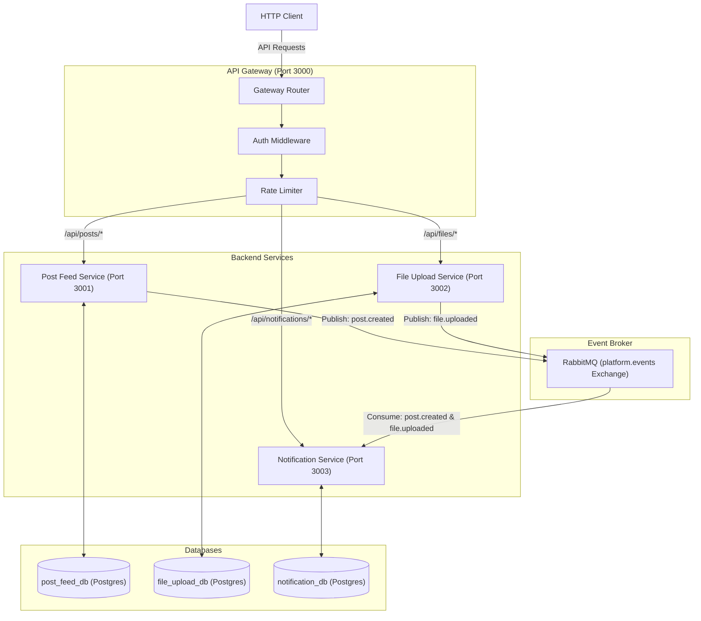

<div align="center">

# Event-Driven Microservices Platform Boilerplate

[](#)
[](#)
[](#)
[](#)
[](#)
[](#)
[](#)

Welcome to the **Microservices Platform Boilerplate**, a production-ready, decoupled, and event-driven microservices architecture built with **TypeScript**, **Node.js**, **Express**, **RabbitMQ**, and **PostgreSQL**, fully orchestrated with **Docker Compose** and documented using **Scalar API Reference (OpenAPI 3.0)**.

This boilerplate represents a modern microservices architecture implementing clean, independent services that communicate asynchronously through a central message broker.

</div>

---

## Architecture Overview

The system consists of **four primary Node.js services** and **two infrastructure components**:



---

## Microservice Directory Breakdown

| Service              | Path                                                             | Port   | Database          | Primary Responsibility                                                                       |
| :------------------- | :--------------------------------------------------------------- | :----- | :---------------- | :------------------------------------------------------------------------------------------- |
| **API Gateway**      | [`services/gateway`](services/gateway)                           | `3000` | —                 | Single entry router, API key & Bearer auth check, rate limiting, downstream headers passing. |
| **Post Feed**        | [`services/post-feed-service`](services/post-feed-service)       | `3001` | `post_feed_db`    | CRUD posts operations, ownership validations, publishing post events.                        |
| **File Upload**      | [`services/file-upload-service`](services/file-upload-service)   | `3002` | `file_upload_db`  | Handles form file uploads, disk persistence, dynamic file cleanup, publishing upload events. |
| **Notification**     | [`services/notification-service`](services/notification-service) | `3003` | `notification_db` | Event subscriber/worker logging activities to database, manual alert dispatch APIs.          |
| **Shared Contracts** | [`services/shared-contracts`](services/shared-contracts)         | —      | —                 | Core types, DTO contracts, and message routing keys shared by all workspaces.                |

---

## Key Features

- **Decoupled Architecture**: Clean "database-per-service" boundary initialized automatically via a central multi-db Postgres container hook.
- **Robust Communication**: Async publisher-subscriber flows utilizing RabbitMQ exchanges and queues, complete with connection retry resilience.
- **Gateway Layer**: Downstream header propagation passes authenticated user payload context (`x-user-id`, `x-user-role`) to isolated microservices.
- **Modern API Documentation**: Fully detailed OpenAPI 3.0 specification (`openapi.yml`) served interactively using **Scalar** (a premium, responsive alternative to Swagger UI).
- **Fully Containerized**: Ready-to-go multi-stage Dockerfiles compiling all workspaces into light Node runtimes under compose control.

---

## Quick Start (Development & Docker)

### Prerequisites

- [Node.js v20+](https://nodejs.org/) installed locally (for local development).
- [Docker Desktop](https://www.docker.com/products/docker-desktop/) running.

### Spin up the Stack under Docker Compose

Simply run:

```bash
docker-compose up --build
```

This single command:

1. Spins up **PostgreSQL** and runs [`init.sql`](docker/postgres/init.sql) to instantiate all service databases.
2. Spins up **RabbitMQ** and establishes health checks.
3. Compiles the **TypeScript** workspaces and boots the entire service tree.

---

## Interactive API Documentation (Scalar UI)

Once your container stack is running, open your browser and navigate to:
**[http://localhost:3000/docs](http://localhost:3000/docs)**

This serves our custom **Scalar API Reference Panel** hosted at the Gateway. It allows you to:

1. Review all schema payloads and parameters.
2. Direct-test endpoints immediately from the browser.
3. Switch easily between Dark and Light mode themes.

---

## Authentication Guide

Public endpoints are shielded by the API Gateway. To authorize your requests, send one of the following headers:

### A. Bearer Auth (Regular User)

- **Header**: `Authorization: Bearer valid-mock-token`
- **Downstream Context**: Automatically resolves as **User**: `user-123` with **Role**: `user`.

### B. Admin API Auth (Admin Privilege)

- **Header**: `X-API-KEY: default-secret-key`
- **Downstream Context**: Automatically resolves as **User**: `system-admin` with **Role**: `admin`.

---

## Comprehensive End-to-End Test Workflow

You can test the full capabilities of the event-driven architecture using `curl`:

### Step 1: Retrieve empty post feed

```bash
curl -X GET http://localhost:3000/api/posts \
  -H "Authorization: Bearer valid-mock-token"
```

### Step 2: Create a post (Triggers a `post.created` event)

```bash
curl -X POST http://localhost:3000/api/posts \
  -H "Authorization: Bearer valid-mock-token" \
  -H "Content-Type: application/json" \
  -d '{"title": "Boilerplate Architecture", "content": "Built with Node, RabbitMQ, and Scalar Docs!"}'
```

> [!NOTE]
> Behind the scenes, the **Post Feed Service** commits the post, then broadcasts a `post.created` event. The **Notification Service** intercepts the message asynchronously and saves two notifications to `notification_db`.

### Step 3: Upload a file (Triggers a `file.uploaded` event)

Create a mock text file:

```bash
echo "Hello Microservices!" > hello.txt
```

Upload the file:

```bash
curl -X POST http://localhost:3000/api/files/upload \
  -H "Authorization: Bearer valid-mock-token" \
  -F "file=@hello.txt"
```

> [!NOTE]
> Behind the scenes, the **File Upload Service** stores the file locally, then broadcasts a `file.uploaded` event. The **Notification Service** catches it and logs an administrator email notification.

### Step 4: Retrieve the Generated Notifications (Verify Broker)

Using Admin credentials, retrieve the complete asynchronous activity log:

```bash
curl -X GET http://localhost:3000/api/notifications \
  -H "X-API-KEY: default-secret-key"
```

_You should see three newly compiled notifications logged dynamically from the message broker!_

---

## Development Commands

If you want to run or test the services locally:

```bash
# Install all package dependencies and link workspaces
npm install

# Compile all workspace packages and create distribution assets
npm run build

# Boot local services in development watch mode (requires local PostgreSQL & RabbitMQ running)
npm run dev
```
